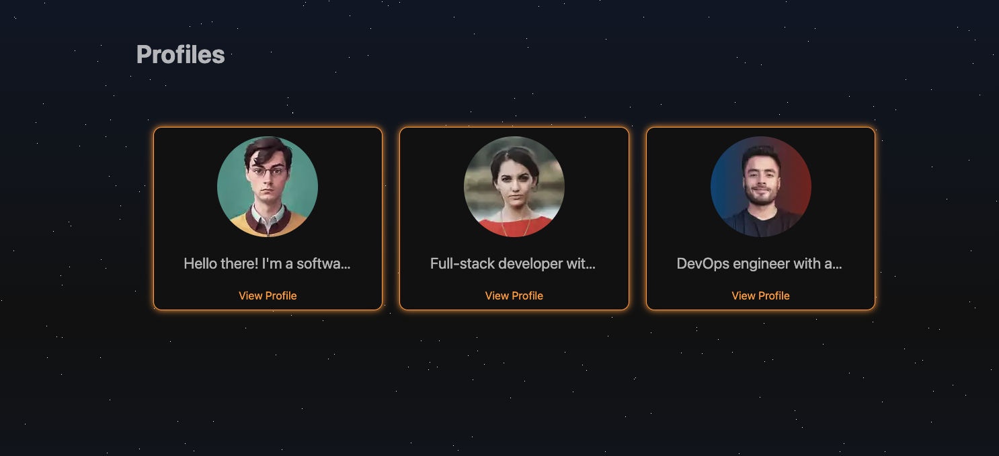

# Linktree Profile

This project is a public profile page similar to Linktree, built with Astro. It demonstrates skills in design, code structure, scalability, and CSS handling without the use of preprocessors or Tailwind.

### Instructions to run the project

1. Clone the repository
2. Run `bun install`
3. Run `bun dev`
4. Open your browser and go to `http://localhost:4321/`

### Images

